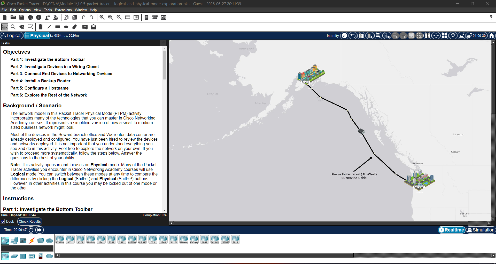

# Cisco CCNA NetAcad Lab Portfolio

This repository contains my practical lab exercises and network topologies completed during the Cisco Networking Academy CCNA course.

---

## Lab 1.0.5: Logical and Physical Mode Exploration

### Objective & Core Tasks
* Explored the physical wiring closet, equipment racks, and component shelf interfaces.
* Connected end devices (PCs, Laptops) using correct network media (Copper Straight-Through, Console cables).
* Installed a backup router into the rack and configured a basic device hostname.

### Topology Preview
.png)

### Lab Status
* **Completion Score:** 100% Successfully Completed
* **Lab Source File:** [Download `.pka` File](./1.0.5-packet-tracer---logical-and-physical-mode-exploration..pka)

### 📸 Lab Progression Gallery

#### 1. Network Topology (Logical View)
.png)

#### 2. Geographic Network Overview (City-to-City Submarine Cable)

#### 3. Branch Office Wiring Closet (Physical Mode Installation)
.png)

#### 4. Hostname Configuration via Device Terminal
.png)

#### 5. Warrenton Data Center Server Racks
.png)

#### 6. Final Assessment Verification (100% Correct)
.png)
